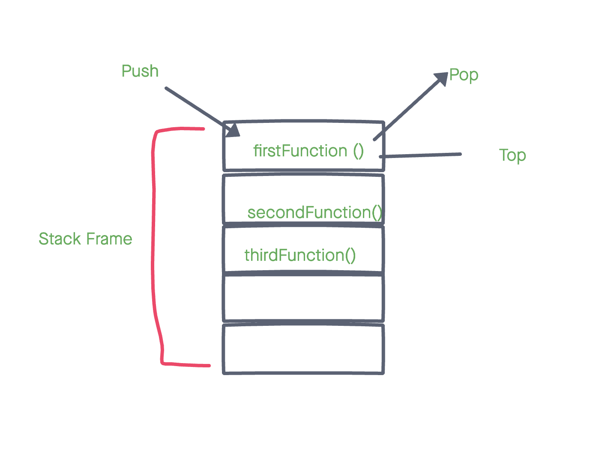

# Reading 10 - In memory storage

## Understanding the JavaScript Call Stack

1. What is a ‘call’?
  A 'call" is a function invocation process in coding.

2. How many ‘calls’ can happen at once?
  A call (function execution) happens one at a time using the top-bottom flow.

3. What does LIFO mean?
  Last In First Out- When the function is returned, it gets pushed into the call stack and is the first one to be taken out.

4. Draw an example of a call stack and the functions that would need to be invoked to generate that call stack.

5. What causes a Stack Overflow?
Stack Overflow is caused by a reoccurring function(function calling itself) without any method to cancel the code.

## JavaScript error messages

1. What is a ‘reference error’?
  A reference error appears in the console in which a variable is not defined or declared. (**Uncaught ReferenceError**: foo is not defined)

2. What is a ‘syntax error’?
  A syntax error occurs when a line of code cannot be parsed because of the syntax is incorrect. (**Uncaught SyntaxError**: Unexpected token o in JSON at position 1)

3. What is a ‘range error’?
  A range error occurs when you allocate the wrong length when you have already established the object with "some kind of length".(**Uncaught RangeError**: Invalid array length)

4. What is a ‘type error’?
  Type does not match, ie try to obtain a specific property in an *undefined* variable. (**Uncaught TypeError**: Cannot read property 'baz' of undefined)

5. What is a breakpoint?
  Breakpoint is the point in your code that you want it to break or exit. To acheive this, one can implement a *debugger* statement.

6. What does the word ‘debugger’ do in your code?
  Tests to see if you code has any bugs.

## Things I want to know more about

**Debugger**
**Call Stack drawing**

[<==BACK](README.md)
