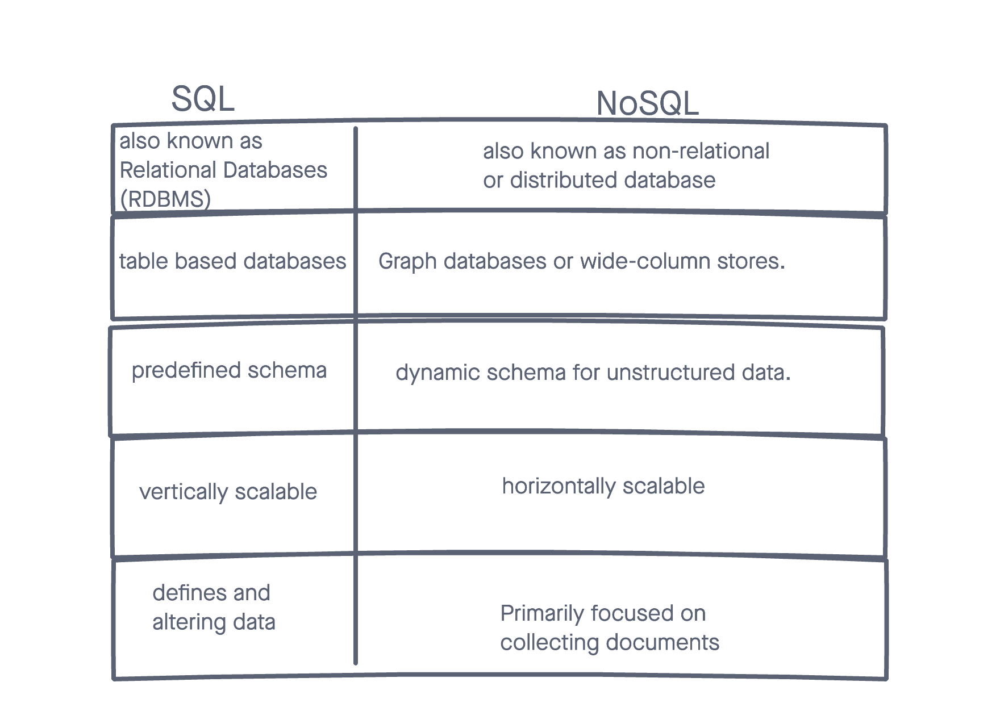

# Reading 11 - Mongo and Mongoose

## NoSQL vs. SQL

1. Fill in the chart below with five differences between SQL and NoSQL databases:
  

2. What kind of data is a good fit for an SQL database?
  Complex query intensive environments are good databases for an SQL database.

3. Give a real world example.
  MySql, Oracle, Sqlite, Postgres, and MS-SQL

4. What kind of data is a good fit a NoSQL database?
  Hierarchical data is a good fit for NoSQL database.

5. Give a real world example.
  MongoDB, BigTable, Redis, RavenDb, Cassandra, Hbase, Neo4j and CouchDb

6. Which type of database is best for hierarchical data storage?
  NoSql is the best type of database for hierarchical data storage.

7.Which type of database is best for scalability?
  SQL databases are the best for vertical scalability.

## NoSQL vs SQL (video)

1. What does SQL stand for?
  SQL stands for **S**tructured **Q**uery **L**language.

2. What is a relational database?
  A **relational** database is a database that works with certain assumptions, or in a certain way, that supports SQL language.

3. What type of structure does a relational database work with?
  Relational database usually uses *tables*. (ie Products table)

4. What is a ‘schema’?
  Schema are defined by *fields*, or the attributes and their values. All records have to follow the schema.

5. What is a NoSQL database?
  No sequel database are used to store large amounts of data in a very efficient way.

6. How does it work?
  NoSQL have databases, but rather than having tables, they have collections. In these collections they have documents, but don't have to abide by the schema.

7. What is inside of a Mongo database?
  Within MongoDB, you can have collections with documents. Documents are objects with attributes and values, and are similarly structured like rows and columns.

8. Which is more flexible - SQL or MongoDB? and why.
  NoSQL is more flexible because it doesn't have to abide by the schema.

9. What is the disadvantage of a NoSQL database?
  NoSQL contains vertical scaling which adds more "power" to the existing server. There is a capacity of the amount of power that you can add, which is a disadvantage of a NoSQL DB.

## Things I want to know more about

NoSQL and the capacity.

[<==BACK](README.md)