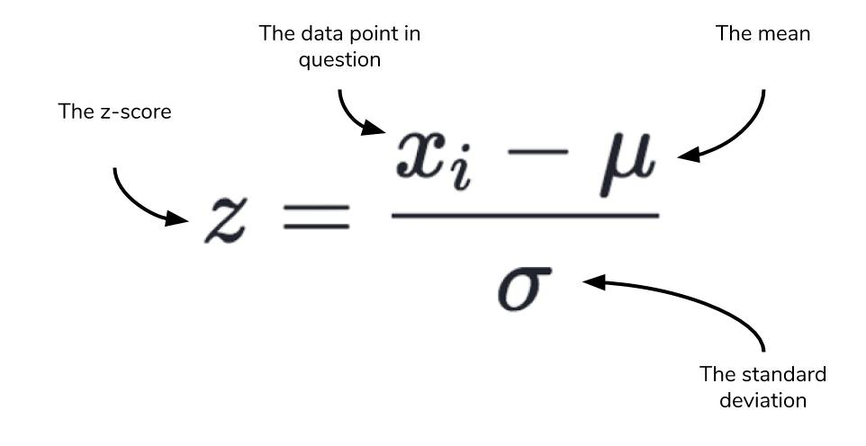

# Reading 9 - Game of Greed 4

## Dunder Methods

**dunder** methods - special or "magic" method
-normal language feature
-imitate likeness of built-in methods

  ex. class LenSupport:
    def __len__(self):
        return 42

    >>> obj = LenSupport()
    >>> len(obj)
    42

### Python Data Model

**Python Data Model**- allow user to harness and utilize sequences, iteration, operating overloading, etc
-powerful API that uses one or more dunder methods

#### Object Initialization

**__int__** - dunder methods that sets up the initial object within the class

  class Account:
    """A simple account class"""

    def __init__(self, owner, amount=0):
        """
        This is the constructor that lets us create
        objects from this class
        """
        self.owner = owner
        self.amount = amount
        self._transactions = []

#### Object Representation

**__repr__**- "official" string representation of an object. Make objects of the class.

**__str**- "informal" string representation of an object

  class Account:
    # ... (see above)

    def __repr__(self):
        return 'Account({!r}, {!r})'.format(self.owner, self.amount)

    def __str__(self):
        return 'Account of {} with starting amount: {}'.format(
            self.owner, self.amount)

#### Iteration

**__len__**- iterable dunder method to iterate through the length of a list, collection, array, etc.

**__getitem__**- gets targeted item at specified location
  class Account:
    def add_transaction(self, amount):
      if not isinstance(amount, int):
          raise ValueError('please use int for amount')
      self._transactions.append(amount)
  
    @property
    def balance(self):
      return self.amount + sum(self._transactions)

    def __len__(self):
        return len(self._transactions)

    def __getitem__(self, position):
        return self._transactions[position]
     >>> len(acc)
      5

     >>> for t in acc:
      ...    print(t)
     20
     -10
     50
     -20
     30

    >>> acc[1]
    -10

**__reverse__**- special method that iterate transaction in reversed order.

#### Operator Overloading for Comparing Accounts

**__eq__**- special method of the == operator
-compare instance of the class

**__lt__**- *less than* special method used to compare instance of the class

  from functools import total_ordering

  @total_ordering
  class Account:
    # ... (see above)

    def __eq__(self, other):
        return self.balance == other.balance

    def __lt__(self, other):
        return self.balance < other.balance

#### Operating Overloading for Merging Accounts

**__add__**- special method that merges all attributes together

  def __add__(self, other):
    owner = '{}&{}'.format(self.owner, other.owner)
    start_amount = self.amount + other.amount
    acc = Account(owner, start_amount)
    for t in list(self) + list(other):
        acc.add_transaction(t)
    return acc

#### Callable Python Objects

**__call__**- special method to make the function callable and usable for other areas in code.

  class Account:
    # ... (see above)

    def __call__(self):
        print('Start amount: {}'.format(self.amount))
        print('Transactions: ')
        for transaction in self:
            print(transaction)
        print('\nBalance: {}'.format(self.balance))

#### Context Manager and the with statement

**Context Manager**- measures that object needs to adhere to so it can be used in addition to the *with* statement.

**__enter__** and **__exit__** method to make a context manager.

  class Account:
    # ... (see above)

    def __enter__(self):
        print('ENTER WITH: Making backup of transactions for rollback')
        self._copy_transactions = list(self._transactions)
        return self

    def __exit__(self, exc_type, exc_val, exc_tb):
        print('EXIT WITH:', end=' ')
        if exc_type:
            self._transactions = self._copy_transactions
            print('Rolling back to previous transactions')
            print('Transaction resulted in {} ({})'.format(
                exc_type.__name__, exc_val))
        else:
            print('Transaction OK')

## Statistics - Probability

**Probability**- what are the chances that an event might happen?

**event**- outcome of interest

**sample space**- all the possibilities that can happen.

To calculate probability:
the times that event occurs divided by sample space.

  import random
  def coin_trial():
    heads = 0
    for i in range(100):
      if random.random() <= 0.5:
        heads +=1
      return heads
  def simulate(n):
    trials = []
    for i in range(n):
        trials.append(coin_trial())
    return(sum(trials)/n)
  simulate(10)
  >>> 5.4
  simulate(100)
  >>> 4.83
  simulate(1000)
  >>> 5.055
  simulate(1000000)
  >>> 4.999781

1.Start the coin toss at 0 and iterates through a hundred coin tosses.
2.If the random coin toss is equal to .5(if it is heads), increase the count by 1 and return the heads.
3. then with simulate you are appending to your number list the actual trial of coin tosses. 
4. you then return the sum that is the entire trial of hundred coin tosses divided by the sample space.

### Data and Distribution

**Normal distribution**- distributes the possibilities equally amongst all events.

**high point**- event with highest rate of potential possibility.
-as the event value spreads away from the high point, the probability rate diminishes drastically.

### Revisiting the Normal

**Central Limit Theorem**- based on the formation of many estimates, the distribution will look similar to a normal distribution.
-The more trials, the likeliness that the average will approach true possibility will increase.

**Three Sigma Rule**- the distance of the observations made in probability fall and the mean
-Include normal observation= 68% of your observations will fall between one standard deviation of the mean. 95% will fall within two, and 99.7% will fall within three (68-95-99.7 rule)

### Z-Score

**Z-score**- the distance in standard deviation the score is from the mean.

[<==BACK](README.md)
