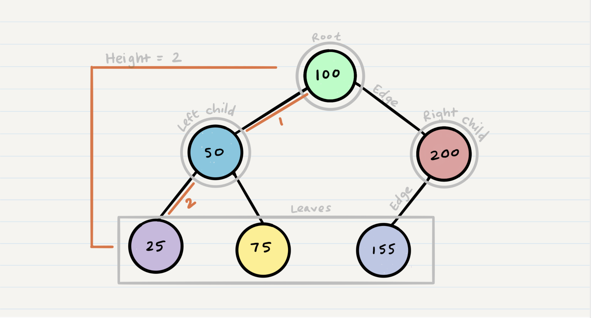

# Reading 15 - Trees



## Common Terminology

**Node** - in terms of Tree node, it is a components that either has its own values stored or has references to other Nodes.

**Root** - the starting node of the tree

**K** - number that specifies maximum number of children taht can be in a k-ary tree. 

**Left** - reference to a child node in a binary tree

**Right** - reference to other child node in a binary tree

**Edge** - connection between parent and child node

**Leaf** - node that doesn't bear children

**Height** - amount of edges from root to furthest leaf

## Traversals

**Depth First Traversal**- going through the depth(height) of tree is prioritized.

### Three Methods of Depth First Traversal

**preOrder** - root >> left >> right

**inOrder** - left >> root >> right

**postOrder** - left >> right >> root

#### Pre-Order

Pre-order:
1. root has been looked at first
2. goes to the left (if there are values)
3. pops out the last root in call stack
4. look for more in that same root to the right
5. continues until no more leafs in the tree.

```python
  ALGORITHM preOrder(root)

  OUTPUT <-- root.value

  if root.left is not NULL
      preOrder(root.left)

  if root.right is not NULL
      preOrder(root.right)
```

#### In Order

```python
  ALGORITHM inOrder(root)
  // INPUT <-- root node
  // OUTPUT <-- in-order output of tree node's values

    if root.left is not NULL
        inOrder(root.left)

    OUTPUT <-- root.value

    if root.right is not NULL
        inOrder(root.right)
```

#### Post Order

```python
  ALGORITHM postOrder(root)
  // INPUT <-- root node
  // OUTPUT <-- post-order output of tree node's values

    if root.left is not NULL
        postOrder(root.left)

    if root.right is not NULL
        postOrder(root.right)

    OUTPUT <-- root.value
```

### Breadth First

Breadth First - going through each level of the tree node by node.
1. traverse using a queue first
2. then dequeue node and use it in code.
3. enqueue left and right children.
4. dequeue front of queue left and right
*note* can dequeue nodes that don't have any children

Pseudo Code:

```python
  ALGORITHM breadthFirst(root)
  // INPUT  <-- root node
  // OUTPUT <-- front node of queue to console

    Queue breadth <-- new Queue()
    breadth.enqueue(root)

    while ! breadth.is_empty()
      node front = breadth.dequeue()
      OUTPUT <-- front.value

      if front.left is not NULL
        breadth.enqueue(front.left)

      if front.right is not NULL
        breadth.enqueue(front.right)
```

## Binary Tree vs K- ary Tree

Binary Trees *restrict* number of children to two

**K-ary Trees** - more than 2 child nodes

### Breadth First Traversal

1. move down a list of children of length k, instead of checking for presence of left and right child.
2. dequeue front followed by that node's children added to stack
3. follow to right

Pseudo Code

```python
  ALGORITHM breadthFirst(root)
  // INPUT  <-- root node
  // OUTPUT <-- front node of queue to console

    Queue breadth <-- new Queue()
    breadth.enqueue(root)

    while ! breadth.is_empty()
      node front = breadth.dequeue()
      OUTPUT <-- front.value

      for child in front.children
          breadth.enqueue(child)
```

## Adding Node

To add node:
1. fill all child spots top down
2. use breadth first traversal and locate first node that doesn't have all children filled and place it there from left to right.

Big O:
time: O(n)
space: O(w) w = largest width of the tree

## Binary Search Tree (BST)

**Binary Search Tree** - tree that does have structure
-organized so that all small values compared to the route are place left and bigger ones than root are to the right.
-compare targeted node against root of the tree. 

Big O:
time: O(h) h = height of the tree
space: O(1)

[<==BACK](README.md)
