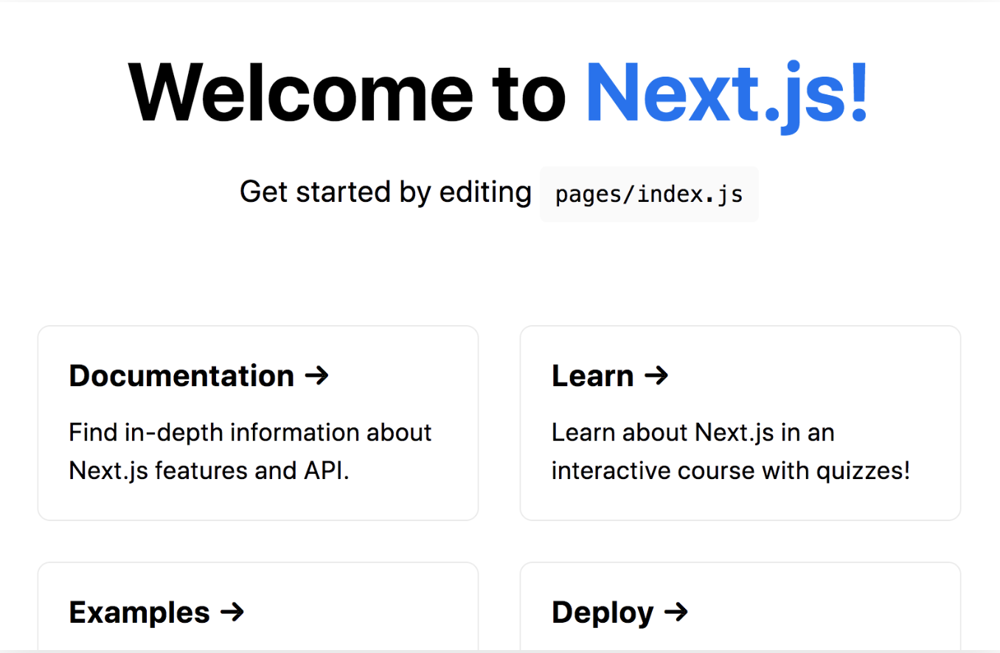

# Reading 39 - REACT 3

Things to consider when creating a complete web app with React:

- Use code splitting

- code should be bundled and transformed using a compiler.

- pre-render pages for performance.

- write server-side code to connect to your React app.

## Next.js - React Framework

**Next.js** - framework that can do all things listed above.

Features:

- An intuitive page-based routing system (with support for dynamic routes)

- Pre-rendering, both static generation (SSG) and server-side rendering (SSR) are supported on a per-page basis

- Automatic code splitting for faster page loads

- Client-side routing with optimized prefetching

- Built-in CSS and Sass support, and support for any CSS-in-JS library

- Development environment with Fast Refresh support

- API routes to build API endpoints with Serverless Functions

- Fully extendable

to create a Next.js app use this command in terminal in your folder:

`npx create-next-app nextjs-blog --use-npm --example "https://github.com/vercel/next-learn/tree/master/basics/learn-starter"`

use the command to fire up localhost:

`npm run dev`

when you go to your `localhost:3000` page should render something like this:



## Navigate Between Pages

**page** - React Component exported from a file in the *pages* directory.

  ie `pages/index.js` is associated with the `/` route.

To create a new page, create a `posts` directory under pages.

```js script
export default function FirstPost() {
  return <h1>First Post</h1>
}
```

## Link Component

use `<a>` HTML tag.

can also use `Link` component from `next/link` to wrap the `<a>` tag.

*in pages/index.js*:

`import Link from 'next/link'`

```html
<h1 className="title">
  Read{' '}
  <Link href="/posts/first-post">
    <a>this page!</a>
  </Link>
</h1>
```

*in pages/posts/first-post.js*:

```html
import Link from 'next/link'

export default function FirstPost() {
  return (
    <>
      <h1>First Post</h1>
      <h2>
        <Link href="/">
          <a>Back to home</a>
        </Link>
      </h2>
    </>
  )
}
```

## Assets, Metadata, and CSS

Next.js can serve **static assets**, like images, under `public` directory.

### Download Profile Picture

- Download your profile picture in .jpg format (or use this file).

- Create an images directory inside of the public directory.

- Save the picture as profile.jpg in the public/images directory.

- The image size can be around 400px by 400px.

- You may remove the unused SVG logo file directly under the public directory.

### Using Image Component

```js script
import Image from 'next/image'

const YourComponent = () => (
  <Image
    src="/images/profile.jpg" // Route of the image file
    height={144} // Desired size with correct aspect ratio
    width={144} // Desired size with correct aspect ratio
    alt="Your Name"
  />
)
```

## MetaData

To change the `<title>` HTML tag:

in *pages/posts/first-post.js*:

`import Head from 'next/head'`

in `FirstPost` component:

```js script
export default function FirstPost() {
  return (
    <>
      <Head>
        <title>First Post</title>
      </Head>
      <h1>First Post</h1>
      <h2>
        <Link href="/">
          <a>Back to home</a>
        </Link>
      </h2>
    </>
  )
}
```

### Tailwind with Next.js

Next.js has *built-in* support for CSS and Sass, allowing you to import `.css` and `.scss` files.

inside `components`:

```js script
export default function Layout({ children }) {
  return <div>{children}</div>
}
```

then in `FirstPost` component:

```js script
import Head from 'next/head'
import Link from 'next/link'
import Layout from '../../components/layout'

export default function FirstPost() {
  return (
    <Layout>
      <Head>
        <title>First Post</title>
      </Head>
      <h1>First Post</h1>
      <h2>
        <Link href="/">
          <a>Back to home</a>
        </Link>
      </h2>
    </Layout>
  )
}
```

*note* to use CSS Modules, the CSS file name must end in `.module.css`

Use `container` class inside `components`:

1.Import CSS file and assign a name to it, like `styles`.

2.use `styles.container` as `className`.

## What is React context

**React context** - allows us to share data, `state` across our components easily.

Types of data that is passed and can be used in a component in your application:

- **Theme data** (like dark or light mode)

- **User data** (the currently authenticated user)

- **Location-specific data** (like user language or locale)

### What problems does React context solve?

Solves:

**props drilling** - when props are passed down multiple levels to a nested component, through components that don't need it.

### Four steps to use React context

1.Create context using the createContext method.

2.Take your created context and wrap the context provider around your component tree.

3.Put any value you like on your context provider using the value prop.

4.Read that value within any component by using the context consumer.

## What is the useContext hook?

`.useContext()` - consume context at the top of the component.

-makes components more concise and allows for creation of custom hooks.

[<==BACK](README.md)
